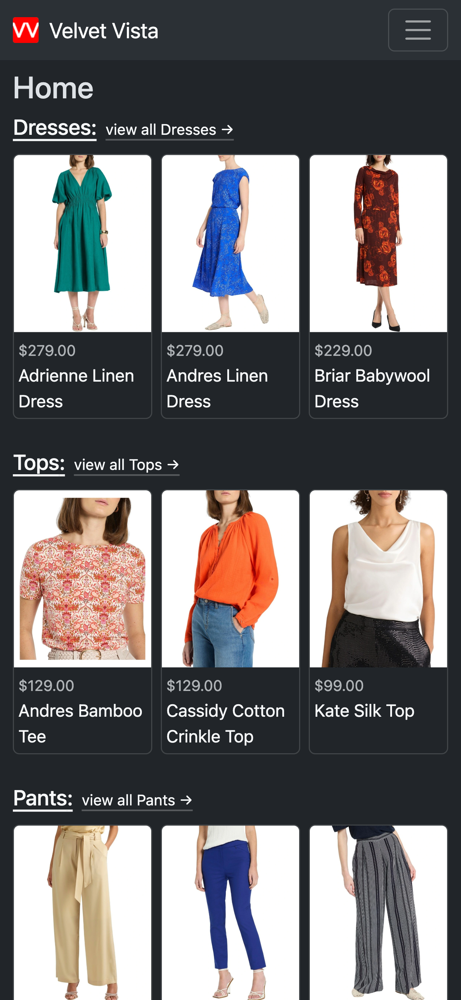
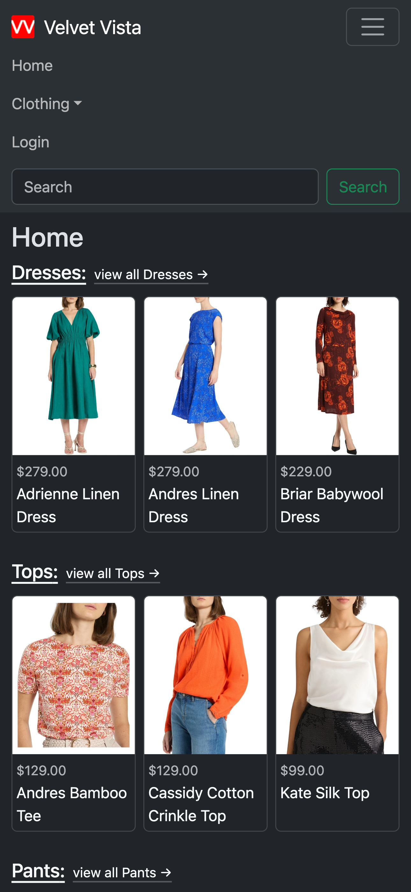
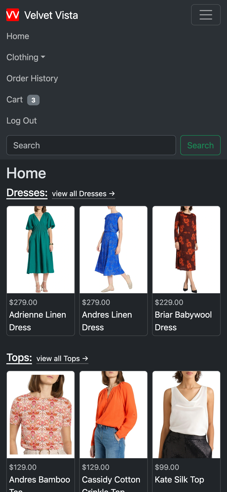
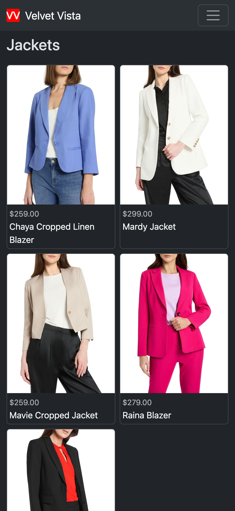
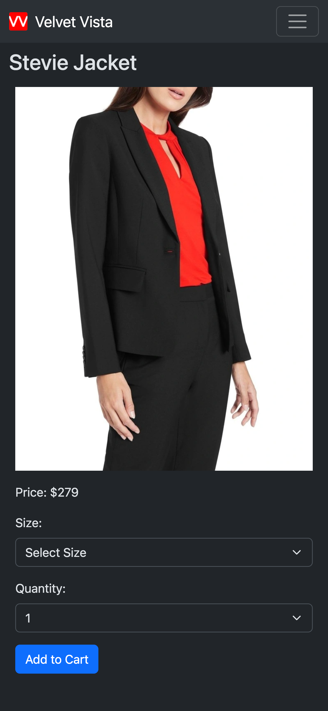
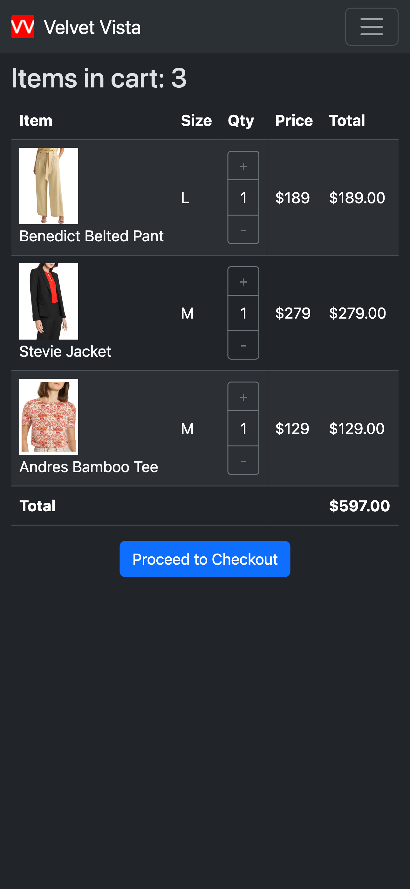
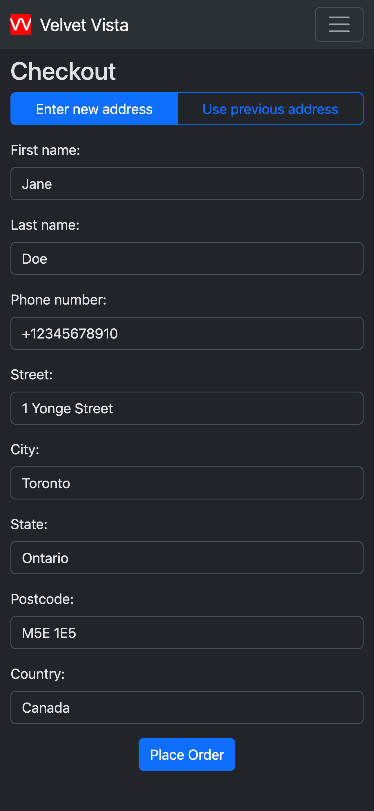
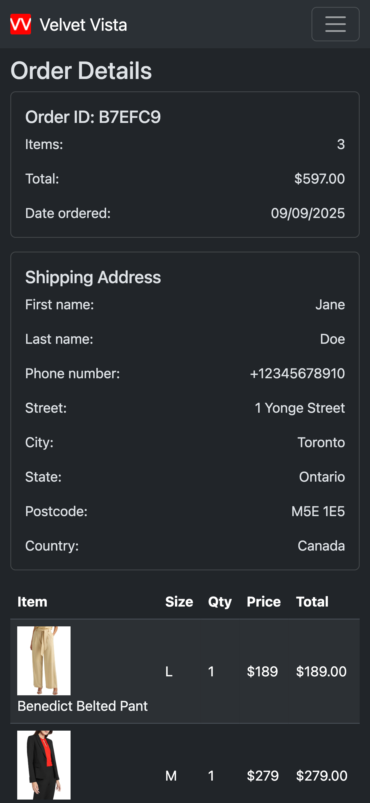
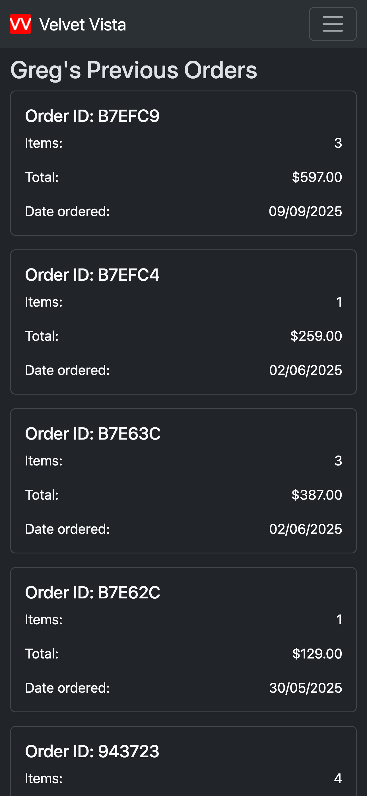
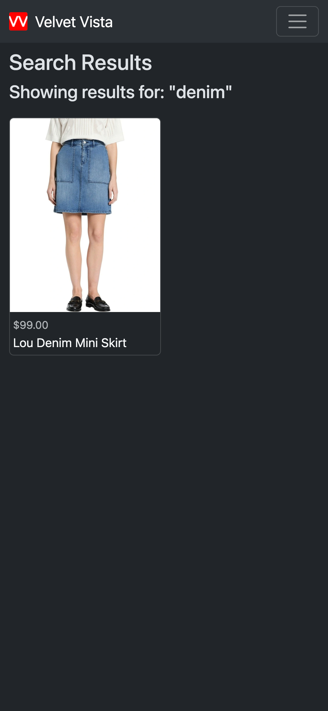

# Velvet Vista
This project is an eCommerce website for a clothing store.

Visitors to the site may browse the items for sale without signing in.

To add items to the cart, and checkout an order, users must sign-in with an account. Visitors can sign-up for an account using email and password.

## Screenshots:
<!-- |  |  |  |
|:---:|:---:|:---:|
| Home Page | Navbar - Visitors | Navbar - Users |

|  |  |  |
|:---:|:---:|:---:|
| Category | Item Detail | Cart |

|  |  |  |
|:---:|:---:|:---:|
| Checkout | Order Details | Order History | -->

<!-- |  |  |  |  |  |
|:---:|:---:|:---:|:---:|:---:|
| &nbsp;&nbsp;Home&nbsp;Page&nbsp;&nbsp; | &nbsp;&nbsp;&nbsp;Navbar&nbsp;-&nbsp;Visitors&nbsp;&nbsp;&nbsp; | &nbsp;&nbsp;&nbsp;Navbar&nbsp;-&nbsp;Users&nbsp;&nbsp;&nbsp; | &nbsp;Category&nbsp;Page&nbsp; | Item&nbsp;Detail&nbsp;Page |

|  |  |  |  |  |
|:---:|:---:|:---:|:---:|:---:|
| Cart Page | Checkout Page | Order Detail Page | Order History Page | Search Page | -->

<!--  -->
&nbsp;&nbsp;&nbsp;&nbsp;
----------------------------------------------------------------

|:---:|:---:|:---:|:---:|:---:|
| Home&nbsp;Page | Navbar&nbsp;-&nbsp;Visitors | Navbar&nbsp;-&nbsp;Users | Category&nbsp;Page | Item&nbsp;Detail&nbsp;Page |

----------------------------------------------------------------

|:---:|:---:|:---:|:---:|:---:|
| Home Page | Navbar - Visitors | Navbar - Users | Category Page | Item Detail Page |

    
    
Home Page

    
    
Home Page

    
    
Home Page

    
    
Home Page

    
    
Home Page

|  |  |  |  |  |
|:---:|:---:|:---:|:---:|:---:|
| Home&nbsp;Page | Navbar&nbsp;-&nbsp;Visitors | Navbar&nbsp;-&nbsp;Users | Category&nbsp;Page | Item&nbsp;Detail&nbsp;Page |

|  |  |  |  |  |
|:---:|:---:|:---:|:---:|:---:|
| Cart Page | Checkout Page | Order Detail Page | Order History Page | Search Page |

## Technologies Used:
* __Node.js__: to run the backend server.
* __Express__: for the backend server framework.
* __MongoDB__: to persist data in to a database.
* __Mongoose__: to interact with the database.
* __BCrypt__: to provide authentication using JavaScript Web Tokens (JWTs).
* __React__: for the frontend single page app (SPA).
* __Vite__: to build the react app.
* __Bootstrap__: to achieve the CSS layout.
* __Heroku__: to host the live app.
* __Atlas__: to host the MongoDB database.

## Getting Started:
[Try the live website here.](https://velvet-vista-30171128f9c5.herokuapp.com/)

The project was planned out in a Trello board, view it on Trello [here.](https://trello.com/b/jf9ay66D/velvet-vista-project-planning)

The Entity Relationship Diagram (ERD) was made using Lucid Chart and can be seen in the Trello board.

Wireframes of the different pages were made using [wireframe|cc](https://wireframe.cc/) and can be seen in the Trello board.

## Future Development:
* Add a payment processor to the checkout page.
* Email receipts to customers.

## Known Bugs:
No known bugs at this time.