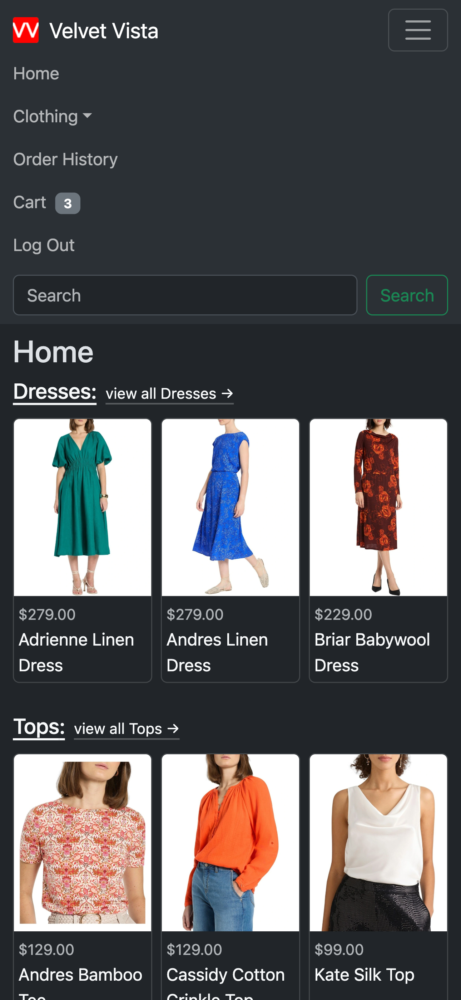

# Velvet Vista
This project is an eCommerce website for a clothing store.

Visitors to the site may browse the items for sale without signing in.

To add items to the cart, and checkout an order, users must sign-in with an account. Visitors can sign-up for an account using email and password.

## Screenshots:
<table width="100%">
  <thead>
    <tr>
      <th width="20%"></th>
      <th width="20%"></th>
      <th width="20%"></th>
      <th width="20%"></th>
      <th width="20%"></th>
    </tr>
  </thead>
  <tbody>
    <tr>
      <td width="20%" align="center">Home Page</td>
      <td width="20%" align="center">Navbar - Visitors</td>
      <td width="20%" align="center">Navbar - Users</td>
      <td width="20%" align="center">Category Page</td>
      <td width="20%" align="center">Item Detail Page</td>
    </tr>
  </tbody>
</table>

<table width="100%">
  <thead>
    <tr>
      <th width="20%"></th>
      <th width="20%"></th>
      <th width="20%"></th>
      <th width="20%"></th>
      <th width="20%"></th>
    </tr>
  </thead>
  <tbody>
    <tr>
      <td width="20%" align="center">Cart Page</td>
      <td width="20%" align="center">Checkout Page</td>
      <td width="20%" align="center">Order Detail Page</td>
      <td width="20%" align="center">Order History Page</td>
      <td width="20%" align="center">Search Page</td>
    </tr>
  </tbody>
</table>

## Technologies Used:
* __Node.js__: to run the backend server.
* __Express__: for the backend server framework.
* __MongoDB__: to persist data in to a database.
* __Mongoose__: to interact with the database.
* __BCrypt__: to provide authentication using JavaScript Web Tokens (JWTs).
* __React__: for the frontend single page app (SPA).
* __Vite__: to build the react app.
* __Bootstrap__: to achieve the CSS layout.
* __Heroku__: to host the live app.
* __Atlas__: to host the MongoDB database.

## Getting Started:
[Try the live website here.](https://velvet-vista-30171128f9c5.herokuapp.com/)

The project was planned out in a Trello board, view it on Trello [here.](https://trello.com/b/jf9ay66D/velvet-vista-project-planning)

The Entity Relationship Diagram (ERD) was made using [Lucid Chart](https://www.lucidchart.com) and can be seen in the Trello board.

Wireframes of the different pages were made using [wireframe|cc](https://wireframe.cc/) and can be seen in the Trello board.

## Future Development:
* Add a payment processor to the checkout page.
* Email receipts to customers.

## Known Bugs:
No known bugs at this time.

## Acknowledgements:
The SVG of the favicon was created using [favicon.io](https://favicon.io/favicon-generator/).